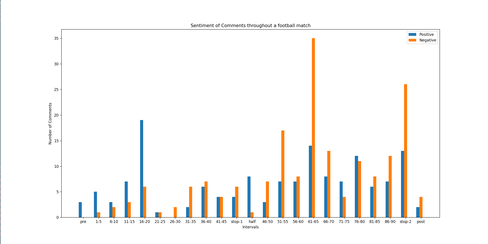

# soccer-match-thread-analysis

Performs text-classification on comments posted in a specific soccer match-thread,
plotting a graph that indicates the mood throughout the game.

### Pre-requisites:

To run this without errors, you will need to enter the following in ``main.py`` right at the end of file:

- ``client_id`` and ``client_secret`` of your reddit account, which can be accessed from https://www.reddit.com/prefs/apps/
- ``submission_id`` of the match-thread. For example, ``100mpme`` is the submission id for the
  match-thread https://www.reddit.com/r/chelseafc/comments/100mpme/match_thread_nottingham_forest_vs_chelsea_english/
- ``day``, ``month``, ``year``, ``hour``, ``minute`` of kick-off.

### How to use:
> ``cd soccer-match-thread-analysis``

> ``pip install -r requirements.txt``

> ``python main.py``

### Note:
Collecting all comments from a large match-thread (>2000 comments) can take from 5-10 minutes. 

### Graph from the match-thread in /r/chelseafc for Chelsea-Nottingham game:

